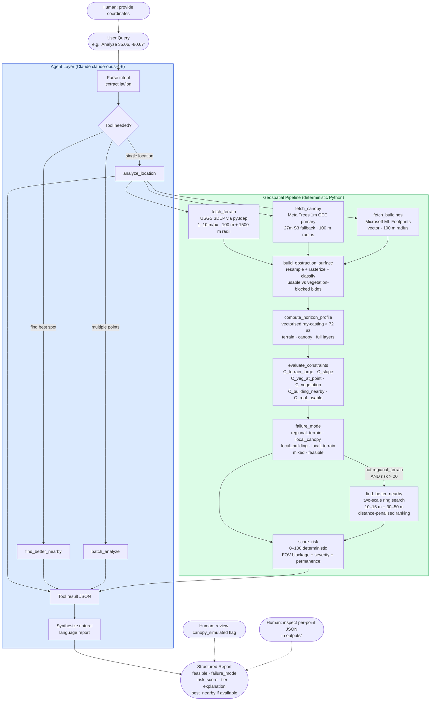

# Architecture: LEO Satellite Risk Analysis Pipeline

## Overview

The system has two modes:

1. **Batch mode** (`main.py`) — runs the full pipeline for a predefined set of test points,
   writes per-point PNG + JSON to `outputs/`.  No LLM involved.

2. **Agent mode** (`src/agent.py`) — a Claude-orchestrated conversational interface.
   Claude handles intent parsing and workflow coordination; all geospatial computation is
   deterministic Python (no LLM in the scoring loop).

---

## Agent Architecture



---

## Component Descriptions

### Agent Layer

| Component | Role |
|-----------|------|
| **Claude (claude-opus-4-6)** | Reasoning and orchestration only. Parses user intent, selects tools, interprets results, writes final report. |
| `run_agent(query)` | Agentic loop: send → tool_use → execute → send result → repeat until `end_turn`. |
| `SYSTEM_PROMPT` | Constrains Claude to call tools for all scores; no LLM guessing of geospatial values. |

### Tool Layer (Claude → Python)

| Tool | Description | When Called |
|------|-------------|-------------|
| `analyze_location(lat, lon)` | Full pipeline for one point. Returns risk score + obstruction breakdown. | Single-point queries |
| `find_better_nearby(lat, lon, radius_m)` | Samples N candidate points around origin, returns lowest-risk location. | When user wants relocation advice |
| `batch_analyze(locations[])` | Runs pipeline sequentially for a list of points. Returns tier distribution. | Multi-point or CSV inputs |

### Geospatial Pipeline Tools

| Module | Data Source | Resolution | Coverage |
|--------|-------------|------------|----------|
| `fetch_terrain` | USGS 3DEP (via py3dep WMS) | 1–10 m/px | CONUS |
| `fetch_canopy` | **Primary:** Meta Trees 1m (GEE, Tolan et al. 2024) via `ee.data.computePixels`; **Fallback:** Meta ALSGEDI 27m (S3 COG) | 1 m/px (GEE) · 27 m/px (fallback) | Global |
| `fetch_buildings` | Microsoft Global ML Footprints | Vector polygons | Global |
| `build_obstruction_surface` | Derived: terrain + canopy + buildings | terrain grid | — |
| `compute_horizon_profile` | Derived: radial ray-casting | 72 azimuths (5° steps) | — |
| `score_risk` | Derived: deterministic formula | — | — |

---

## Data Flow

```
User query
    │
    ▼
Claude (parse intent + select tool)
    │
    ├─► analyze_location(lat, lon)
    │       │
    │       ├── fetch_terrain(lat, lon, r=1500m, hint=10m/px)   ← DEM far-field
    │       ├── fetch_terrain(lat, lon, r=100m,  hint=1m/px)    ← DEM near-field
    │       ├── fetch_canopy (lat, lon, r=100m)                 ← canopy height raster
    │       └── fetch_buildings(lat, lon, r=100m)               ← building GeoDataFrame
    │               │
    │               ▼
    │       build_obstruction_surface(near_terrain, canopy, buildings)
    │           → surface[rows,cols] in absolute meters ASL
    │               │
    │               ▼
    │       compute_horizon_profile × 3
    │           hz_terrain   ← far-field DEM only
    │           hz_canopy    ← near-field terrain + canopy
    │           hz_buildings ← near-field terrain + canopy + buildings
    │               │
    │               ▼
    │       classify_obstruction → dominant type + blocked fractions
    │               │
    │               ▼
    │       score_risk → {risk_score: 0–100, risk_tier, explanation}
    │               │
    │               ▼
    │       JSON result
    │
    ▼
Claude (synthesise natural language report)
    │
    ▼
User response
```

---

## Caching Strategy

| Layer | Cache Location | Cache Key | TTL |
|-------|----------------|-----------|-----|
| Microsoft Buildings | `data/buildings/{quadkey9}.parquet` | Bing quadkey zoom-9 | Permanent (static dataset) |
| Google Buildings | `data/buildings/google_{s2token}.parquet` | S2 level-4 token | Permanent |
| Terrain (3DEP) | Not cached (py3dep handles internally) | — | Session |
| Canopy 1m (GEE) | `data/tiles/canopy/gee1m_{lat}_{lon}_{radius}.tif` | lat/lon/radius at ~1 m precision | Permanent (LZW-compressed GeoTIFF) |
| Canopy 27m (S3) | Not cached (streaming window read) | — | None |

---

## State Management

The agent uses a simple in-memory message list (`messages: list[dict]`) as conversation state.
Tool results are injected as `tool_result` blocks in the Claude message history.
No persistent state between `run_agent()` calls by default (stateless API).

For batch workflows (`main.py`), results are written to `outputs/point_{label}.json` so they
can be re-loaded without re-fetching data.

---

## Failure Handling

| Failure Mode | Behaviour |
|---|---|
| USGS 3DEP timeout | Retry up to 2× per resolution, then fall back to coarser (1→3→10→30 m/px). RuntimeError raised only if all resolutions fail. |
| GEE canopy unavailable (no creds/quota) | Falls back to Meta ALSGEDI 27m S3 stream. If S3 also fails, falls through to simulation fallback (`simulated=True` flag set in result). |
| Microsoft Buildings tile not in index | Exception propagated; Google Open Buildings fallback attempted. |
| Google Buildings returns 0 results | ValueError raised, agent reports empty buildings layer (not an error — some areas have no buildings). |
| Complete pipeline failure for one point | Caught in `main.py`; point is skipped and logged; rest of batch continues. |
| Agent tool call exception | Caught in agent loop; error JSON returned to Claude; Claude can retry or explain the failure to user. |
| `failure_mode == "regional_terrain"` | Local search skipped automatically — moving 50 m cannot escape a far-field ridge. `failure_mode` field in result identifies root cause for downstream triage. |

---

## Human-in-the-Loop Points

1. **Coordinate input**: If the user doesn't provide coordinates, the agent asks.
2. **Relocation advice**: The agent proactively offers `find_better_nearby` if risk is high.
3. **Canopy simulation flag**: Results flagged with `canopy_simulated: true` are surfaced to
   the user so they know the canopy data is an estimate, not real measurement.
4. **Batch review**: JSON outputs in `outputs/` can be reviewed and filtered before acting on results.
